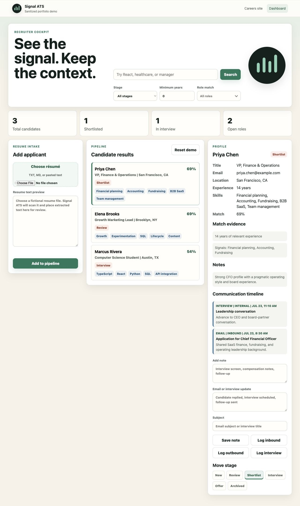
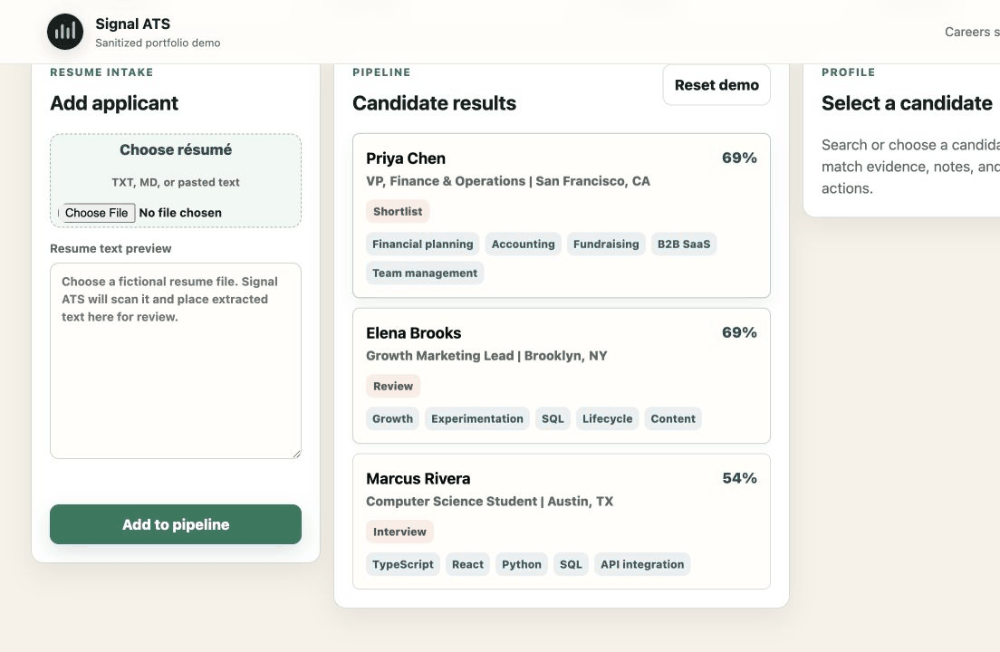
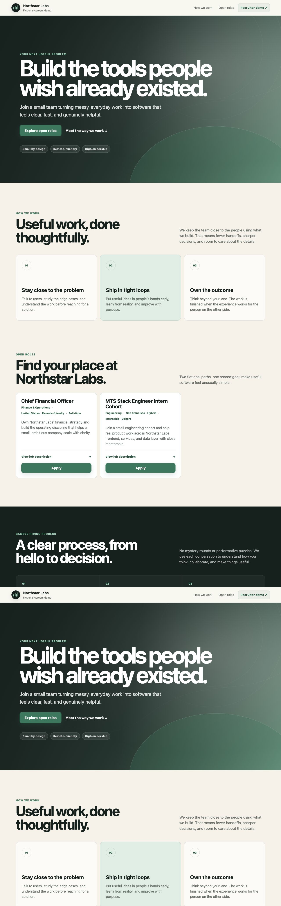

# Signal ATS - Sanitized Portfolio Interface

Signal ATS is a sanitized portfolio reconstruction of an applicant-tracking interface I built while working with an early-stage startup. It demonstrates how I translate an ambiguous operating bottleneck into a usable workflow and working software.

This public version contains no employer branding, proprietary assets, credentials, production integrations, private repository history, or real applicant data. **Northstar Labs is a fictional company, and every role, candidate, message, email address, and phone number is synthetic.**



## Why I built it

Recruiting work was fragmented across candidate intake, resume review, search, prioritization, communications, and pipeline updates. I designed and implemented a single interface that makes that work visible and actionable.

The original internal workflow was initiated proactively after I recognized that the startup needed an ATS before it was ready to adopt a larger HR platform. It included inbox-based resume intake and was designed with future HR and payroll integration in mind. Those employer-specific integrations are described here at a high level but intentionally excluded from this public reconstruction.

My contribution covered:

- problem definition and workflow design;
- product decisions about what to automate and what to leave human-controlled;
- the recruiter and applicant interfaces;
- deterministic, explainable candidate matching;
- browser-local demo persistence;
- local authentication and resume-text extraction;
- tests, documentation, and privacy boundaries.

## Product walkthrough

The fictional careers interface publishes sample roles and accepts synthetic application information. The recruiter workspace can:

- search and filter a fictional candidate pool;
- compare candidates with open roles using inspectable evidence without presenting a universal candidate score;
- review structured candidate profiles;
- assign an owner, next action, due date, and supportive response target;
- configure role competencies and collect independent, evidence-based scorecards;
- create editable communication drafts and record draft or approved status without sending email;
- review deterministic, evidence-linked recruiter assistance that cannot make hiring decisions;
- document a human decision and create a minimum-necessary onboarding handoff;
- inspect synthetic operational analytics and browser-local audit events;
- demonstrate retention, export-request, deletion-request, and role-permission concepts;
- add notes and log communication activity;
- move candidates through recruiting stages;
- parse TXT, Markdown, DOCX, and text-based PDF resumes in local mode;
- reset the interface to a fully synthetic demo dataset.

### Applicant interaction

Selecting a fictional applicant opens the complete recruiting context: structured profile data, explainable match evidence, notes, communication history, and stage controls.





## Run locally

The complete demo requires only Python 3:

```sh
python3 server.py
```

The terminal prints a local URL and freshly generated credentials. The server binds to `127.0.0.1`, so it is reachable only from the computer running it.

- Fictional careers page: `http://127.0.0.1:4174/careers.html`
- Recruiter login: `http://127.0.0.1:4174/admin.html`

Optional local credentials can be supplied with:

```sh
ATS_DEMO_ADMIN_USERNAME="local-recruiter" ATS_DEMO_ADMIN_PASSWORD="use-a-long-local-password" python3 server.py
```

Run the Python verification suite with:

```sh
python3 -m unittest -v
```

If Node.js is installed, the combined JavaScript syntax and Python test check is:

```sh
npm run check
```

## Architecture

| Layer | Sanitized implementation |
| --- | --- |
| Applicant experience | Static fictional careers page and browser-local sample intake |
| Recruiter experience | Ownership, response targets, evidence review, scorecards, communications, human decisions, onboarding, and synthetic analytics |
| Assistance | Deterministic evidence extraction with editable output; no connected model or automated decisions |
| Persistence | Browser `localStorage` seeded only with synthetic candidates |
| Local service | Python standard-library server with loopback binding, login, session checks, and resume extraction |
| Frontend | Semantic HTML, responsive CSS, and vanilla JavaScript |

## Privacy and production boundaries

This is a portfolio prototype, not a production ATS. Do not enter real applicant information.

The interface demonstrates role boundaries, audit events, retention state, export requests, and deletion requests in browser-local storage. It does not provide production enforcement, a shared database, managed identity, encrypted hosted storage, malware scanning, immutable audit logs, verified data-subject workflows, or real email delivery. Those boundaries are documented explicitly rather than hidden behind a polished interface.

## Repository guide

- `careers.html` - fictional careers and application experience
- `admin.html` - local demo login
- `index.html` - recruiter workspace
- `app.js` - synthetic data, explainable matching, and interface behavior
- `server.py` - loopback-only authentication and resume extraction
- `test_server.py` - credential and parsing regression tests
- `docs/PRIVACY_AND_COMPLIANCE.md` - production applicant-data checklist
- `docs/DATA_MODEL.md` - proposed production data model
- `docs/BUILD_PLAN.md` - implemented scope and future production work

## Sanitization statement

The original private project and its history are not included. This repository was created from a clean history after removing employer names, logos, domains, integration plans, hosting metadata, screenshots, and person-specific test fixtures. All remaining people and company details are fictional examples.
